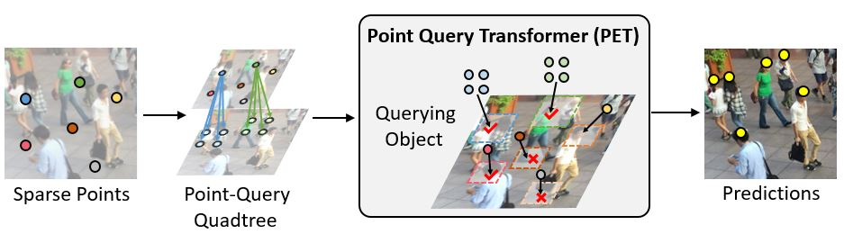

# Point-Query Quadtree for Crowd Counting, Localization, and More (ICCV 2023)

This repository includes the official implementation of the paper: 

[**Point-Query Quadtree for Crowd Counting, Localization, and More**](https://arxiv.org/abs/2308.13814)

International Conference on Computer Vision (ICCV), 2023

[Chengxin Liu](https://cxliu0.github.io/)<sup>1</sup>, [Hao Lu](https://sites.google.com/site/poppinace/)<sup>1</sup>, [Zhiguo Cao](http://english.aia.hust.edu.cn/info/1085/1528.htm)<sup>1</sup>, [Tongliang Liu](https://tongliang-liu.github.io/)<sup>2</sup>

<sup>1</sup>Huazhong University of Science and Technology, China  

<sup>2</sup>The University of Sydney, Australia

[[Paper]](https://arxiv.org/abs/2308.13814) | [[Supplementary]](https://drive.google.com/file/d/1WxdtOaEEccYrXuNQTn1k29lFDAetBm63/view?usp=sharing)



## Highlights

We formulate crowd counting as a decomposable point querying process, where sparse input points could split into four new points when necessary. This formulation exhibits many appealing properties:

- *Intuitive*: The input and output are both interpretable and steerable
  
- *Generic*: PET is applicable to a number of crowd-related tasks, by simply adjusting the input format
  
- *Effective*: PET reports state-of-the-art crowd counting and localization results
  

## Installation

- Required packages:
  
```
torch
torchvision
numpy
opencv-python
scipy
matplotlib
```

- Install packages:

```
pip install -r requirements.txt
```


## Data Preparation

- Download crowd-counting datasets, e.g., [ShanghaiTech](https://github.com/desenzhou/ShanghaiTechDataset).
  
- We expect the directory structure to be as follows:
  

```
PET
├── data
│    ├── ShanghaiTech
├── datasets
├── models
├── ...
```

- Alternatively, you can define the path of the dataset in [datasets/__init__.py](datasets/__init__.py)

- For [UCF-QNRF](https://www.crcv.ucf.edu/data/ucf-qnrf/), [JHU-Crowd++](http://www.crowd-counting.com/), and [NWPU-Crowd](https://gjy3035.github.io/NWPU-Crowd-Sample-Code/) datasets, please refer to [preprocess_dataset.py](https://github.com/cxliu0/PET/blob/main/preprocess_dataset.py):

  * change [```dataset```](https://github.com/cxliu0/PET/blob/main/preprocess_dataset.py#L217) and [```data_root```](https://github.com/cxliu0/PET/blob/main/preprocess_dataset.py#L218)
  * run ```python preprocess_dataset.py```


## Training

- Download ImageNet pretrained [vgg16_bn](https://download.pytorch.org/models/vgg16_bn-6c64b313.pth), and put it in ```pretrained``` folder. Or you can define your pre-trained model path in [models/backbones/vgg.py](models/backbones/vgg.py)
  

- To train PET on ShanghaiTech PartA, run
  
  ```
  sh train.sh
  ```
  

## Evaluation

- Modify [eval.sh](eval.sh)
  - change ```--resume``` to your local model path
- Run

```
sh eval.sh
```

## Pretrained Models

- Environment:
```
python==3.8
pytorch==1.12.1
torchvision==0.13.1
```

- Models:

| Dataset                  | Model Link  | Training Log  | MAE |
| ------------------------ | ----------- | --------------| ----|
| ShanghaiTech PartA       |  [SHA_model.pth](https://drive.google.com/file/d/1QwV8hrEDs1LQ4h1TH4KSL8tB51AImNMT/view?usp=drive_link)   | [SHA_log.txt](https://drive.google.com/file/d/1UpY61L0KWRA9c29CM9FMX34bHyprnPUY/view?usp=sharing) | 49.08 |
| ShanghaiTech PartB       |  [SHB_model.pth](https://drive.google.com/file/d/10HK42xC6fmOK-5lQfu-pTn6oAHYeRUhv/view?usp=sharing)   | [SHB_log.txt](https://drive.google.com/file/d/1M74PI0XuJtQraPOUiCQJSCUjrWoJUq3n/view?usp=sharing) | 6.18 |
| UCF_QNRF                 |  [UCF_QNRF.pth](https://drive.google.com/file/d/129l__gW51UtTQnPKM-90lTZo508-Eh7I/view?usp=sharing)    | - | - |
| JHU_Crowd                |  [JHU_Crowd.pth](https://drive.google.com/file/d/1D4vtoYhQuvj_5onJaXJRtWrlwrl2ckbE/view?usp=sharing)   | - | - |
| NWPU_Crowd               |  [NWPU_Crowd.pth](https://drive.google.com/file/d/1MX7tQAexyc9slrt7TaNSK7j8RtSvnI2H/view?usp=sharing)  | - | - |


## Citation

If you find this work helpful for your research, please consider citing:

```
@InProceedings{liu2023pet,
  title={Point-Query Quadtree for Crowd Counting, Localization, and More},
  author={Liu, Chengxin and Lu, Hao and Cao, Zhiguo and Liu, Tongliang},
  booktitle={Proceedings of the IEEE/CVF International Conference on Computer Vision (ICCV)},
  year={2023}
}
```


## Permission

This code is for academic purposes only. Contact: Chengxin Liu (cx_liu@hust.edu.cn)


## Acknowledgement

We thank the authors of [DETR](https://github.com/facebookresearch/detr) and [P2PNet](https://github.com/TencentYoutuResearch/CrowdCounting-P2PNet) for open-sourcing their work.


